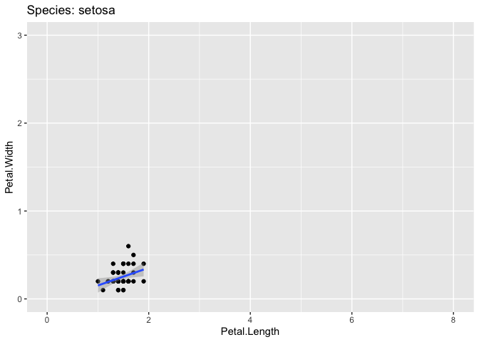
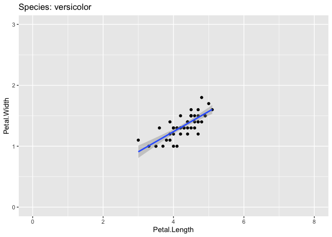

Activity 7: Computational thinking 1: functions and iteration
================

# Overview

Welcome! This is the first “computational thinking” lesson, which is
about two topics: writing your own functions and performing iterations.
I will go over very basic examples of each, but know that these are
topics that will be very useful if using R for “programming” sorts of
tasks.

------------------------------------------------------------------------

You will submit one output for this activity:

1.  A **PDF** of a rendered Quarto document with all of your R code.
    Please create a new Quarto document (e.g. don’t use this
    `README.qmd`), include all of the code that appears in this
    document, in addition to adding your own code and **answers to all
    of the questions** in the “Q#” sections. Submit this through
    Gradescope.

*If you have trouble submitting as a PDF, please ask Calvin or Malin for
help. If we still can’t solve it, you can submit the .qmd file instead.*

A reminder: **Please label the code** in your final submission in two
ways: 1) denote your answers to each question using headers that
correspond to the question you’re answering and 2) thoroughly “comment”
your code: remember, this means annotating your code directly by typing
descriptions of what each line does after a `#`. This will help future
you!

------------------------------------------------------------------------

Let’s start by reading in the relevant packages

``` r
library(tidyverse)
library(here)
```

------------------------------------------------------------------------

# 1. Functions

Functions take the form of

``` default
my.function  <- function(arg1, arg2, ... ){

the function's code (body) is nestled between curly braces

return(object)

} 
```

To create a function, we start by assigning the function a name with the
assignment operator, such as `my.function <-`. This names the function.
To save a function, it must be named.

Then, we use the `function()` function (yes, there’s a function called
`function`) to tell R it will be a function. We list the **arguments**
in our function between parentheses and include any default values.
These are the function’s inputs. Then, in between two curly braces { },
we enter R code that tells R what to do with the inputs, and what to
return to the function user (the output).

------------------------------------------------------------------------

## Working with single values as input

Let’s start out with a very simple mathematical example and write a
function that takes a number as input, adds 1 to that number, and then
returns that new output to us.

- Let’s name the function `add_one`.
- Within the brackets of the function, we will supply only one argument:
  `x`. `x` will be the number that gets taken in as input.
- Within the curly brackets, we will tell the function what to do with
  `x`. In this case, we will add 1 to it and store it as a data object
  called `output`.
- Lastly, let’s tell the function to return our `output`, aka just print
  out the results that are stored in the data object

``` r
# Create a new function called add_one
# x will be the only input to the function
add_one  <- function(x){
  
  # Add x and 1 together, store as the object "output"
  output <- x + 1
  
  # Print out whatever is stored in "output"
  return(output)
  
} 
```

Look in your Environment tab in the top-right; a function called
`add_one` should have popped up. That means our function is stored and
ready to go!

Let’s use our function. We will supply the number `10` to our function
as input.

``` r
# Supply 10 to our function
add_one(x = 10)
```

    [1] 11

Our very first homemade function! Nice!

------------------------------------------------------------------------

Let’s make this a little more complicated and add in a second argument.
This function will take two numbers as input and add them together.
Let’s call those arguments `x` and `y`. Separate them with a comma
within the `function()` function.

``` r
# Create a new function called add_together
# x and y will be the two arguments to the function
add_together  <- function(x, y){
  
  # Add x and y together, store as the object "output"
  output <- x + y
  
  # Print out whatever is stored in "output"
  return(output)
  
} 
```

### Q1.1 Feed our new function two numbers

Feed our new function `add_together()` two numbers: Add together a 3 and
a 5 within the function

------------------------------------------------------------------------

### Q1.2 Feed our new function a number and a character string

What happens if a function receives unexpected input? Feed our new
function `add_together()` 3 and “five” instead of 3 and 5. Copy and
paste the error code you receive and describe what you think it’s
telling you.

Important for QMD: When you try to render this document, Quarto will get
mad that you’re running code that doesn’t work. In the code chunk where
you add together 3 and “five”, substitute the `{r}` for `{r eval=FALSE}`
so that it does not evaluate this chunk of code (click “Source” instead
of “Visual” in the top left of the document in order to see the `{r}`)

------------------------------------------------------------------------

You can access the source code for a function by typing it’s name
without parentheses and clicking enter.

``` r
add_together
```

    function (x, y) 
    {
        output <- x + y
        return(output)
    }

------------------------------------------------------------------------

### Q1.3 Create your own function!

Time to try it yourself! First, create a new function called `math_time`
with three arguments, x, y, and z, that executes this equation:

$$(x - y)^2/z$$

Then, run that equation with `x = 5`, `y = 2`, and `z = 9`. What is the
output?

------------------------------------------------------------------------

## Working with vectors as input

Let’s use vectors as input instead of just numbers. Let’s write a
function to convert a vector of weights from pounds into kilograms. To
go from pounds to kilograms, we multiply the vector in pounds by
\~0.454. This multiplies every element in the vector by 0.454.

Just like before, we tell the function what we want our argument(s) to
be. Let’s supply one argument called `weights`.

``` r
# Create a function called lbs_to_kg that takes a data object 'weights' as input
lbs_to_kg  <- function(weights){
  
  # Multiply weights by 0.454, store as the object "output"
  output <- weights*0.454
  
  # Print out whatever is stored in "output"
  return(output)
  
} 
```

Next, let’s make a vector of bison weights

``` r
bison <- c(1000, 800, 1200, 1400)
```

And feed it to the function:

``` r
lbs_to_kg(weights = bison)
```

    [1] 454.0 363.2 544.8 635.6

Each element was multiplied by 0.454!

------------------------------------------------------------------------

### Q1.4 Calculate deviation from a mean

Here’s a tricky one: Write a function called `deviation` that takes a
vector as an argument. Then, make that function:

1)  Calculate a mean value for the vector

2)  Subtract that mean from each element in the vector

3)  Return the output from 2)

After you’ve created the function, feed the `bison` vector to it as
input.

I hope that you are starting to see a glimmer of the utility of writing
functions; they can make things much easier for us, while also making us
feel like super cool coders.

------------------------------------------------------------------------

# 2. Iteration

Iteration in R means repeatedly performing the same action but in
different ways or on different “things”. We’ve already snuck this in in
a couple ways:

- facet_wrap() and facet_grid() draw a plot for each subset variable.
- group_by() and summarize() compute summary statistics for each grouped
  variable.

------------------------------------------------------------------------

## across()

We’ll start with yet another dplyr function, `across()`. To illustrate
iterating using the `across()` function, let’s look at the built-in iris
flower morphometric data. Take a look at the help page to familiarize
yourself with the columns.

``` r
# Look at the first 6 rows of iris
head(iris)
```

      Sepal.Length Sepal.Width Petal.Length Petal.Width Species
    1          5.1         3.5          1.4         0.2  setosa
    2          4.9         3.0          1.4         0.2  setosa
    3          4.7         3.2          1.3         0.2  setosa
    4          4.6         3.1          1.5         0.2  setosa
    5          5.0         3.6          1.4         0.2  setosa
    6          5.4         3.9          1.7         0.4  setosa

### Q2.1: What are the units that the sepal and petal columns are measured in?

------------------------------------------------------------------------

Let’s say that we want to calculate means for all four of these columns
separately for each species. In the last lesson I asked you to first
pivot the energy source columns to long format, and then group those
variables and summarize them to calculate a mean. However, sometimes
having the columns pivoted all together in a single column doesn’t make
sense. For instance, here, we might want `Petal.length` and
`Petal.width` to be distinct columns that can be related to one another
(for instance in a graph comparing the two).

One option is summarize each column separately by typing out the
equation for each column:

``` r
iris %>% 
  group_by(Species) %>% 
  summarize(Sepal.Length = mean(Sepal.Length),
            Sepal.Width = mean(Sepal.Width),
            Petal.Length = mean(Petal.Length),
            Petal.Width = mean(Petal.Width))
```

    # A tibble: 3 × 5
      Species    Sepal.Length Sepal.Width Petal.Length Petal.Width
      <fct>             <dbl>       <dbl>        <dbl>       <dbl>
    1 setosa             5.01        3.43         1.46       0.246
    2 versicolor         5.94        2.77         4.26       1.33 
    3 virginica          6.59        2.97         5.55       2.03 

You can imagine that this will get very tedious if you have tens or even
hundreds of columns. Instead, you can use `across()`, which iterates
across each column that you specify.

You’ll use the first two arguments to `across()` every time you use it:
the first argument, `.cols`, specifies which columns you want to iterate
over, and the second argument, `.fns`, specifies what to do with each
column.

``` r
iris %>%
  group_by(Species) %>% 
  summarize(across(.cols = c(Sepal.Length, Sepal.Width, Petal.Length, Petal.Width), 
                   .fns = mean))
```

    # A tibble: 3 × 5
      Species    Sepal.Length Sepal.Width Petal.Length Petal.Width
      <fct>             <dbl>       <dbl>        <dbl>       <dbl>
    1 setosa             5.01        3.43         1.46       0.246
    2 versicolor         5.94        2.77         4.26       1.33 
    3 virginica          6.59        2.97         5.55       2.03 

As a sneaky shortcut, you can also say `Sepal.Length:Petal.Width` to
indicate that you want to iterate across all columns from `Sepal.Length`
to `Petal.Width`. (It also works if you specify column number instead of
column name, such as `1:4`)

``` r
iris %>%
  group_by(Species) %>% 
  summarize(across(.cols = Sepal.Length:Petal.Width, 
                   .fns = mean))
```

    # A tibble: 3 × 5
      Species    Sepal.Length Sepal.Width Petal.Length Petal.Width
      <fct>             <dbl>       <dbl>        <dbl>       <dbl>
    1 setosa             5.01        3.43         1.46       0.246
    2 versicolor         5.94        2.77         4.26       1.33 
    3 virginica          6.59        2.97         5.55       2.03 

------------------------------------------------------------------------

There are two additional selection techniques that are particularly
useful for selecting columns in `across()`: `everything()` and
`where()`.

`everything()` is straightforward: it selects every (non-grouping)
column:

``` r
iris %>%
  group_by(Species) %>% 
  summarize(across(.cols = everything(), 
                   .fns = mean))
```

    # A tibble: 3 × 5
      Species    Sepal.Length Sepal.Width Petal.Length Petal.Width
      <fct>             <dbl>       <dbl>        <dbl>       <dbl>
    1 setosa             5.01        3.43         1.46       0.246
    2 versicolor         5.94        2.77         4.26       1.33 
    3 virginica          6.59        2.97         5.55       2.03 

Note the grouping column(s) (in this case `Species`) are not included in
`across()`, because they’re automatically preserved by `summarize()`.

------------------------------------------------------------------------

### Q2.2 Summarize to calculate the median across all columns

Group the `iris` data by `species` and calculate a `median` across all
of the columns. (What function do you think you should use to calculate
a median?)

------------------------------------------------------------------------

`where()` is another way to select columns, and allows you to select
columns based on their type:

- `where(is.numeric)` selects all numeric columns.
- `where(is.character)` selects all character string columns.
- `where(is.Date)` selects all date columns.
- `where(is.POSIXct)` selects all date-time columns.
- `where(is.logical)` selects all logical columns.

``` r
iris %>%
  group_by(Species) %>% 
  summarize(across(.cols = where(is.numeric), 
                   .fns = mean))
```

    # A tibble: 3 × 5
      Species    Sepal.Length Sepal.Width Petal.Length Petal.Width
      <fct>             <dbl>       <dbl>        <dbl>       <dbl>
    1 setosa             5.01        3.43         1.46       0.246
    2 versicolor         5.94        2.77         4.26       1.33 
    3 virginica          6.59        2.97         5.55       2.03 

------------------------------------------------------------------------

### Q2.3 Summarize to calculate the mean across all numeric columns in the cereal data

1)  Read in the `cereal` data that we worked with back in the first data
    wrangling lesson. It is already stored in the `data` folder of this
    repository.
2)  Group the data by manufacturer and calculate a mean value for all of
    the *numeric* columns in that dataset.

------------------------------------------------------------------------

## For-loops

### Loop through a simple equation

A commonly used method of coding when you want to repeat a task a
defined number of times is the for loop. We have been teaching you how
to code largely using `tidyverse` functions; for loops are not
particularly common when using `tidyverse` because the creators of it
built functions that allow us to do the same or similar iterative tasks
in more intuitive ways. For instance, `across()`, from above, as well as
`group_by()`/`summarize()` and `facet_wrap()` can accomplish what used
to be only doable with for loops (or writing your own functions).
Despite this, for loops are a fundamental part of all coding languages,
and so we will introduce them here!

The most basic example of a for loop is:

``` r
for (i in 1:5) {
  # Print out whatever the value of i is
  print(i)
}
```

    [1] 1
    [1] 2
    [1] 3
    [1] 4
    [1] 5

This is a dynamic bit of code where an “index” `i` is iteratively
replaced by each value in the vector `1:5` (which is 1, 2, 3, 4, 5).

Let’s dissect what the loop is doing: because the first value in our
sequence `1:5` is 1, the loop starts by replacing i with 1 and runs
everything between the { }. Loops typically use i as the counter, short
for iteration, but you are free to use whatever you like, such as `x`,
`number`, or `rhubarb`.

We could do this all manually of course. To manually run the first two
iterations of the loop, we would run:

``` r
# First iteration where i = 1:
i <- 1
print(i)
```

    [1] 1

``` r
# Second iteration where i = 2
i <- 2
print(i)
```

    [1] 2

The for loop makes this all automated though, and loops through the
number of values we tell it to, in this case, 5 values.

We can make things a little more complex; let’s multiply our i value by
2

``` r
for (i in 1:5) {
  print(i*2)
}
```

    [1] 2
    [1] 4
    [1] 6
    [1] 8
    [1] 10

As with before, the for loop starts with `i = 1` and runs what we tell
it to. When `i = 1`, it prints out `i*2`, which equals 2. Then, when
`i = 2`, it prints out `i*2`, which equals 4, and so forth.

------------------------------------------------------------------------

### Q2.4 Create a for loop that iterates from 1 to 10 and squares the value of the index `i`

Create a for loop that iterates from 1 to 10 and squares the value of
the index `i`, then prints out that output

------------------------------------------------------------------------

### Simulate data using a for-loop

One fun way we can use a for loop is by iteratively simulating data.
Let’s simulate population growth using the equation:

$$ N[t] = N[t - 1] * lambda $$

The population at time `t` is `N[t]`, and we can calculate it by taking
the population from the previous time step `t-1`, which is represented
by `N[t-1]`, and multiplying that by a growth rate `lambda`. Think of
this as if you had 100 individuals in time `t-1` and you population was
growing by 20%, `lambda` would equal 1.2, so your population at time `t`
would be: `100*1.2 = 120`. Let’s simulate this over 20 time steps.

``` r
N0 = 100  #initial population size

years = 20  #number of years into the future

N = vector(length = years)  # create an empty vector to store pop. sizes

N[1] = N0  #initial population size should be the first N

lambda = 1.2  #growth rate
```

Let’s look at that vector we created:

``` r
print(N)
```

     [1] 100   0   0   0   0   0   0   0   0   0   0   0   0   0   0   0   0   0   0
    [20]   0

We can see that the first value is 100, since we assigned `N[1]` to be
100, but all the rest are zeroes. The for loop will iterate from the
second value through the the number of years (20) and fill in the rest!

When we use square brackets after a vector, e.g. `N[5]`, we are able to
reference that element of the vector, in this case the 5th value in
vector N. Just to demonstrate, if we now ask for the 5th element in
vector `N`, we will get zero, whereas if we ask for the first, we will
get 100

``` r
N[5]
```

    [1] 0

``` r
N[1]
```

    [1] 100

Now we will start the for loop: Here we say that element number “t” in
the vector N will equal the previous year’s N multiplied by lambda. For
instance, in year `t = 5`, the newly created population value in year 5
will equal the population in year `t = 4` times `lambda`.

``` r
# For every year t in 2 through 20 (remember, "years" also equals 20), apply the following equation
for (t in 2:20) {
  N[t] = N[t - 1] * lambda # Apply the equation
}
```

Now let’s check out what N looks like

``` r
N
```

     [1]  100.0000  120.0000  144.0000  172.8000  207.3600  248.8320  298.5984
     [8]  358.3181  429.9817  515.9780  619.1736  743.0084  891.6100 1069.9321
    [15] 1283.9185 1540.7022 1848.8426 2218.6111 2662.3333 3194.8000

Nice, it’s all filled in! Let’s create a datframe from this data and
plot it to look at

``` r
# Store the data output as a dataframe for plotting
popn_data <- tibble(years = 1:years, # Make the years column = 1, 2, 3, ..., 20
                    popn = N) # Make the population column the corresponding population vector that we calculated
```

``` r
# Now plot the data with years on the x axis and population on the y
popn_data %>% 
  ggplot(aes(x = years, y = popn)) +
  geom_point()
```


------------------------------------------------------------------------

### Q2.5a Rerun the for loop with the following parameters:

Copy and paste the for loop from above, but change the initial
parameters so that:

- The initial population size = 300
- The growth rate = 0.95
- The number of years to iterate over = 50

### Q2.5b Plot the data and interpret

Plot your data and describe how the population is changing.

------------------------------------------------------------------------

### Loop through data frames

Lastly, I want to demonstrate how to loop through dataframes in a couple
different ways. Up above, we were referencing certain elements of a
vector by index, aka by which number element it was (e.g. `N[5]` is the
5th element in the vector N). Vectors are one dimensional, so you can
access any element within it with just one number. Data frames, however,
are two dimensional: they have both rows and columns. Let’s check out
the `iris` data again:

``` r
head(iris)
```

      Sepal.Length Sepal.Width Petal.Length Petal.Width Species
    1          5.1         3.5          1.4         0.2  setosa
    2          4.9         3.0          1.4         0.2  setosa
    3          4.7         3.2          1.3         0.2  setosa
    4          4.6         3.1          1.5         0.2  setosa
    5          5.0         3.6          1.4         0.2  setosa
    6          5.4         3.9          1.7         0.4  setosa

If we apply square brackets to the dataframe to extract elements, we can
apply 1 or 2 numbers within them to reference either rows, columns, or
both. This takes to form of: `data[row#, column#]`. If we want to access
just a row, we leave the column number blank, and vice versa.

For instance, to get the first row:

``` r
iris[1,]
```

      Sepal.Length Sepal.Width Petal.Length Petal.Width Species
    1          5.1         3.5          1.4         0.2  setosa

To get the data in the third column (which will print out as a vector):

``` r
iris[,3]
```

      [1] 1.4 1.4 1.3 1.5 1.4 1.7 1.4 1.5 1.4 1.5 1.5 1.6 1.4 1.1 1.2 1.5 1.3 1.4
     [19] 1.7 1.5 1.7 1.5 1.0 1.7 1.9 1.6 1.6 1.5 1.4 1.6 1.6 1.5 1.5 1.4 1.5 1.2
     [37] 1.3 1.4 1.3 1.5 1.3 1.3 1.3 1.6 1.9 1.4 1.6 1.4 1.5 1.4 4.7 4.5 4.9 4.0
     [55] 4.6 4.5 4.7 3.3 4.6 3.9 3.5 4.2 4.0 4.7 3.6 4.4 4.5 4.1 4.5 3.9 4.8 4.0
     [73] 4.9 4.7 4.3 4.4 4.8 5.0 4.5 3.5 3.8 3.7 3.9 5.1 4.5 4.5 4.7 4.4 4.1 4.0
     [91] 4.4 4.6 4.0 3.3 4.2 4.2 4.2 4.3 3.0 4.1 6.0 5.1 5.9 5.6 5.8 6.6 4.5 6.3
    [109] 5.8 6.1 5.1 5.3 5.5 5.0 5.1 5.3 5.5 6.7 6.9 5.0 5.7 4.9 6.7 4.9 5.7 6.0
    [127] 4.8 4.9 5.6 5.8 6.1 6.4 5.6 5.1 5.6 6.1 5.6 5.5 4.8 5.4 5.6 5.1 5.1 5.9
    [145] 5.7 5.2 5.0 5.2 5.4 5.1

And to get the exact value in the cell in the 1st row and 3rd column:

``` r
iris[1,3]
```

    [1] 1.4

We can replace all of these numbers with the `i` index to iteratively
perform some action on a number of rows or columns that we want.

For instance, let’s print out all of the values for each column, 1
through 5. I’ve added a little bit of text that will print out to tell
us what column we’re on

``` r
for (i in 1:5) {
  
  # This prints out a statement saying "Here's column i", 
  #but the i gets replaced with the number that it's currently at
  print(paste("Here's column",i))
  
  # This prints out column i
  print(iris[,i])
}
```

    [1] "Here's column 1"
      [1] 5.1 4.9 4.7 4.6 5.0 5.4 4.6 5.0 4.4 4.9 5.4 4.8 4.8 4.3 5.8 5.7 5.4 5.1
     [19] 5.7 5.1 5.4 5.1 4.6 5.1 4.8 5.0 5.0 5.2 5.2 4.7 4.8 5.4 5.2 5.5 4.9 5.0
     [37] 5.5 4.9 4.4 5.1 5.0 4.5 4.4 5.0 5.1 4.8 5.1 4.6 5.3 5.0 7.0 6.4 6.9 5.5
     [55] 6.5 5.7 6.3 4.9 6.6 5.2 5.0 5.9 6.0 6.1 5.6 6.7 5.6 5.8 6.2 5.6 5.9 6.1
     [73] 6.3 6.1 6.4 6.6 6.8 6.7 6.0 5.7 5.5 5.5 5.8 6.0 5.4 6.0 6.7 6.3 5.6 5.5
     [91] 5.5 6.1 5.8 5.0 5.6 5.7 5.7 6.2 5.1 5.7 6.3 5.8 7.1 6.3 6.5 7.6 4.9 7.3
    [109] 6.7 7.2 6.5 6.4 6.8 5.7 5.8 6.4 6.5 7.7 7.7 6.0 6.9 5.6 7.7 6.3 6.7 7.2
    [127] 6.2 6.1 6.4 7.2 7.4 7.9 6.4 6.3 6.1 7.7 6.3 6.4 6.0 6.9 6.7 6.9 5.8 6.8
    [145] 6.7 6.7 6.3 6.5 6.2 5.9
    [1] "Here's column 2"
      [1] 3.5 3.0 3.2 3.1 3.6 3.9 3.4 3.4 2.9 3.1 3.7 3.4 3.0 3.0 4.0 4.4 3.9 3.5
     [19] 3.8 3.8 3.4 3.7 3.6 3.3 3.4 3.0 3.4 3.5 3.4 3.2 3.1 3.4 4.1 4.2 3.1 3.2
     [37] 3.5 3.6 3.0 3.4 3.5 2.3 3.2 3.5 3.8 3.0 3.8 3.2 3.7 3.3 3.2 3.2 3.1 2.3
     [55] 2.8 2.8 3.3 2.4 2.9 2.7 2.0 3.0 2.2 2.9 2.9 3.1 3.0 2.7 2.2 2.5 3.2 2.8
     [73] 2.5 2.8 2.9 3.0 2.8 3.0 2.9 2.6 2.4 2.4 2.7 2.7 3.0 3.4 3.1 2.3 3.0 2.5
     [91] 2.6 3.0 2.6 2.3 2.7 3.0 2.9 2.9 2.5 2.8 3.3 2.7 3.0 2.9 3.0 3.0 2.5 2.9
    [109] 2.5 3.6 3.2 2.7 3.0 2.5 2.8 3.2 3.0 3.8 2.6 2.2 3.2 2.8 2.8 2.7 3.3 3.2
    [127] 2.8 3.0 2.8 3.0 2.8 3.8 2.8 2.8 2.6 3.0 3.4 3.1 3.0 3.1 3.1 3.1 2.7 3.2
    [145] 3.3 3.0 2.5 3.0 3.4 3.0
    [1] "Here's column 3"
      [1] 1.4 1.4 1.3 1.5 1.4 1.7 1.4 1.5 1.4 1.5 1.5 1.6 1.4 1.1 1.2 1.5 1.3 1.4
     [19] 1.7 1.5 1.7 1.5 1.0 1.7 1.9 1.6 1.6 1.5 1.4 1.6 1.6 1.5 1.5 1.4 1.5 1.2
     [37] 1.3 1.4 1.3 1.5 1.3 1.3 1.3 1.6 1.9 1.4 1.6 1.4 1.5 1.4 4.7 4.5 4.9 4.0
     [55] 4.6 4.5 4.7 3.3 4.6 3.9 3.5 4.2 4.0 4.7 3.6 4.4 4.5 4.1 4.5 3.9 4.8 4.0
     [73] 4.9 4.7 4.3 4.4 4.8 5.0 4.5 3.5 3.8 3.7 3.9 5.1 4.5 4.5 4.7 4.4 4.1 4.0
     [91] 4.4 4.6 4.0 3.3 4.2 4.2 4.2 4.3 3.0 4.1 6.0 5.1 5.9 5.6 5.8 6.6 4.5 6.3
    [109] 5.8 6.1 5.1 5.3 5.5 5.0 5.1 5.3 5.5 6.7 6.9 5.0 5.7 4.9 6.7 4.9 5.7 6.0
    [127] 4.8 4.9 5.6 5.8 6.1 6.4 5.6 5.1 5.6 6.1 5.6 5.5 4.8 5.4 5.6 5.1 5.1 5.9
    [145] 5.7 5.2 5.0 5.2 5.4 5.1
    [1] "Here's column 4"
      [1] 0.2 0.2 0.2 0.2 0.2 0.4 0.3 0.2 0.2 0.1 0.2 0.2 0.1 0.1 0.2 0.4 0.4 0.3
     [19] 0.3 0.3 0.2 0.4 0.2 0.5 0.2 0.2 0.4 0.2 0.2 0.2 0.2 0.4 0.1 0.2 0.2 0.2
     [37] 0.2 0.1 0.2 0.2 0.3 0.3 0.2 0.6 0.4 0.3 0.2 0.2 0.2 0.2 1.4 1.5 1.5 1.3
     [55] 1.5 1.3 1.6 1.0 1.3 1.4 1.0 1.5 1.0 1.4 1.3 1.4 1.5 1.0 1.5 1.1 1.8 1.3
     [73] 1.5 1.2 1.3 1.4 1.4 1.7 1.5 1.0 1.1 1.0 1.2 1.6 1.5 1.6 1.5 1.3 1.3 1.3
     [91] 1.2 1.4 1.2 1.0 1.3 1.2 1.3 1.3 1.1 1.3 2.5 1.9 2.1 1.8 2.2 2.1 1.7 1.8
    [109] 1.8 2.5 2.0 1.9 2.1 2.0 2.4 2.3 1.8 2.2 2.3 1.5 2.3 2.0 2.0 1.8 2.1 1.8
    [127] 1.8 1.8 2.1 1.6 1.9 2.0 2.2 1.5 1.4 2.3 2.4 1.8 1.8 2.1 2.4 2.3 1.9 2.3
    [145] 2.5 2.3 1.9 2.0 2.3 1.8
    [1] "Here's column 5"
      [1] setosa     setosa     setosa     setosa     setosa     setosa    
      [7] setosa     setosa     setosa     setosa     setosa     setosa    
     [13] setosa     setosa     setosa     setosa     setosa     setosa    
     [19] setosa     setosa     setosa     setosa     setosa     setosa    
     [25] setosa     setosa     setosa     setosa     setosa     setosa    
     [31] setosa     setosa     setosa     setosa     setosa     setosa    
     [37] setosa     setosa     setosa     setosa     setosa     setosa    
     [43] setosa     setosa     setosa     setosa     setosa     setosa    
     [49] setosa     setosa     versicolor versicolor versicolor versicolor
     [55] versicolor versicolor versicolor versicolor versicolor versicolor
     [61] versicolor versicolor versicolor versicolor versicolor versicolor
     [67] versicolor versicolor versicolor versicolor versicolor versicolor
     [73] versicolor versicolor versicolor versicolor versicolor versicolor
     [79] versicolor versicolor versicolor versicolor versicolor versicolor
     [85] versicolor versicolor versicolor versicolor versicolor versicolor
     [91] versicolor versicolor versicolor versicolor versicolor versicolor
     [97] versicolor versicolor versicolor versicolor virginica  virginica 
    [103] virginica  virginica  virginica  virginica  virginica  virginica 
    [109] virginica  virginica  virginica  virginica  virginica  virginica 
    [115] virginica  virginica  virginica  virginica  virginica  virginica 
    [121] virginica  virginica  virginica  virginica  virginica  virginica 
    [127] virginica  virginica  virginica  virginica  virginica  virginica 
    [133] virginica  virginica  virginica  virginica  virginica  virginica 
    [139] virginica  virginica  virginica  virginica  virginica  virginica 
    [145] virginica  virginica  virginica  virginica  virginica  virginica 
    Levels: setosa versicolor virginica

We can expand on this by performing some sort of operation on the
columns that we are extracting. Let’s now take the mean of each column
before printing it, but this time only iterate up to i = 4, since we
know that column 5 is the column with species names in them:

``` r
for (i in 1:4) {
  
  # This prints out a statement saying "Here's column i", but the i gets replaced with the number that it's currently at
  print(paste("Here's column",i))
  
  # This prints out column i
  print(mean(iris[,i]))
}
```

    [1] "Here's column 1"
    [1] 5.843333
    [1] "Here's column 2"
    [1] 3.057333
    [1] "Here's column 3"
    [1] 3.758
    [1] "Here's column 4"
    [1] 1.199333

Now we have a mean value for every column. We could have easily done
this with our across function too:

``` r
iris %>% 
  summarize(across(.cols = 1:4, 
                   .fns = mean))
```

      Sepal.Length Sepal.Width Petal.Length Petal.Width
    1     5.843333    3.057333        3.758    1.199333

### Q2.6 Which do you prefer?

Which makes more sense to you: summarizing with a for loop or with the
summarize/across functions?

------------------------------------------------------------------------

A nice thing to remember with for loops is that you can do many things
within the loop. For instance, here I will create a vector of column
names and print out the “i”th element. Since i is going to equal the
same number when I print out the column name vs the column values, it
will match up nicely.

``` r
for (i in 1:4) {
  # Fetch the column names of the dataframe, store in a vector "names"
  names <- colnames(iris)
  
  # Print out the "i"th element of the vector to print alongside the output
  print(names[i])
  
  # This prints out column i
  print(mean(iris[,i]))
}
```

    [1] "Sepal.Length"
    [1] 5.843333
    [1] "Sepal.Width"
    [1] 3.057333
    [1] "Petal.Length"
    [1] 3.758
    [1] "Petal.Width"
    [1] 1.199333

------------------------------------------------------------------------

### Q2.7 Annotate this code with what you think it’s doing

For the last question, I have created a chunk of code here that does a
few things. Go through and on each line where you see a pound sign,
comment what you think each line is doing. I’ve done the first for you
as an example. Remember that you can highlight small bits of code to run
those particular portions, even within a for loop (e.g. highlighting
`iris$Species` within the `unique()` function and hitting run will only
run `iris$Species` or highlighting and running `spp_names` will show you
what is stored in `spp_names`).

``` r
# Store a vector of unique species names from the Species column of Iris
spp_names <- unique(iris$Species)

# 
for (i in 1:length(spp_names)) {
  
  filt_data <- iris %>% 
    # 
    filter(Species == spp_names[i])
  
  # 
  plot <- filt_data %>% 
    # 
    ggplot(aes(x = Petal.Length,
               y = Petal.Width)) +
    # 
    geom_point() +
    # 
    geom_smooth(method = "lm") +
    # 
    lims(x = c(0,8),
         y = c(0,3)) +
    # 
    ggtitle(paste("Species:", spp_names[i]))
  
  # 
  print(plot)
}
```






------------------------------------------------------------------------

Congrats on getting to the end!!!

------------------------------------------------------------------------
